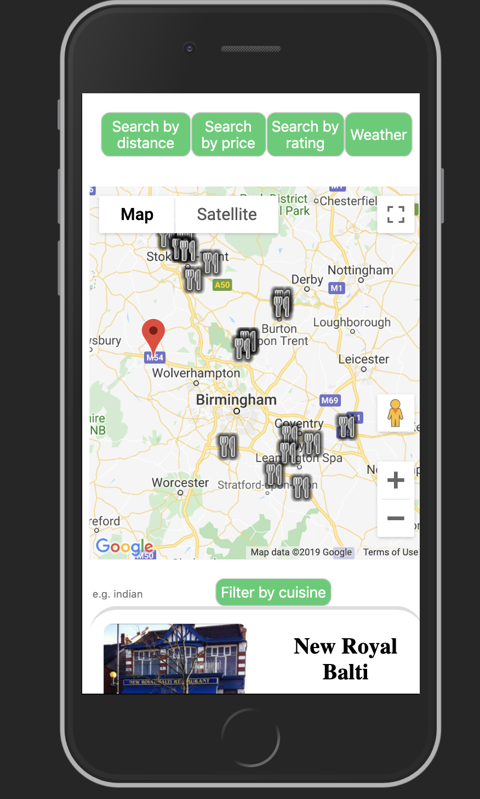
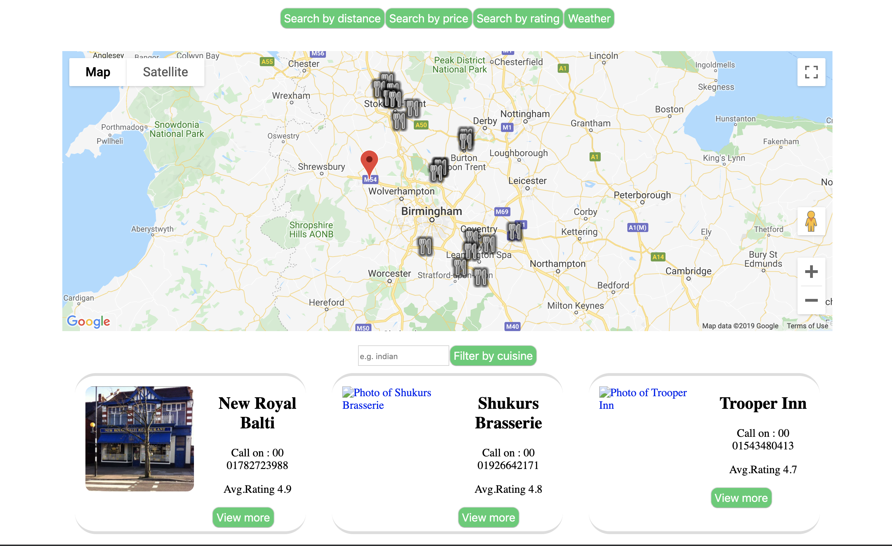

# Project-1 Restaurant Search

## About the app

Can be accessed by clicking: https://nalinkane.github.io/Project-1/

Our Restaurant search was created with a tourist/foodie in mind. Our client wants to find restaurants in the nearby area and to be able to sort his findings by distance/price/rating. For that purpose, our website collects the client's coordinates to establish the nearby eateries. The restaurants are displayed in a column(mobiles) and additionally, in rows for desktop. The name, image and a phone number are displayed initially. By clicking "View more" on underneath the restaurant's details, the client will be able to access a given restaurant's cuisine type, an average price for two, an address and the opening times.

The results can be filtered by inputting the cuisine type in the box underneath the map and once clicked, a given restaurant's image takes the client to the restaurant's site on www.zomato.com.

Additionally, the client can view the weather in the area (temperature, the state of the skies and the real feel of the temperature). This is to make a decision about distance/transport easier for the client.

### Mobile version screenshot

### Desktop version screenshot

## Technologies used

- Zomato API
- Google Maps
- Weather API
